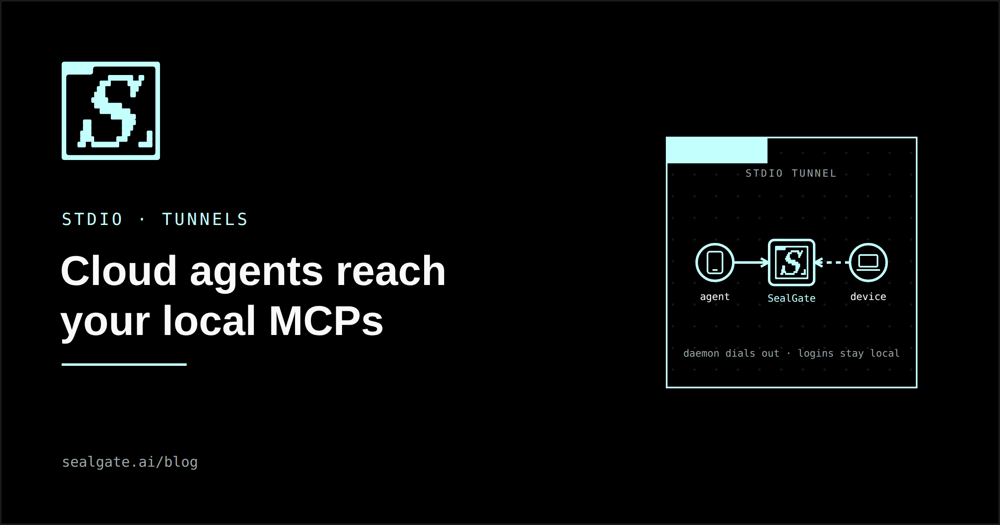
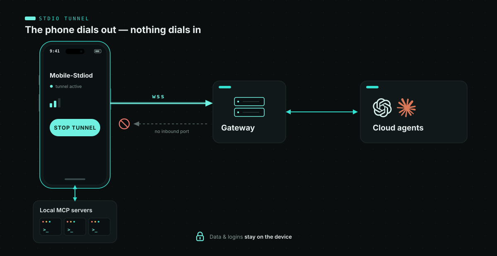
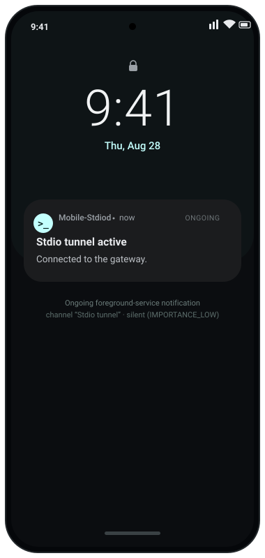

<p align="center">
  
</p>

<h1 align="center">Mobile-Stdiod</h1>

 An Android app
template for an **stdio tunnel** — a device-side daemon that lets cloud agents
reach the MCP (Model Context Protocol) servers running on your phone. It holds a
single **outbound** WebSocket to a hosted gateway, so there is no inbound port to
open, and your data and logins stay on the device.

Based on the design in
[Stdio Tunnels: Bridging Cloud Agents to Local MCPs](https://sealgate.ai/blog/stdio-tunnels-cloud-agents-reach-local-mcps).

> This is a **starter template**. The tunnel transport is stubbed out (see
> `TunnelService.connect`); the app builds, installs, runs, and shows a
> Start/Stop control surface to build on.

## Architecture

<p align="center">
  
</p>

- The daemon opens **one outbound WebSocket** — no incoming ports, works behind
  NAT and mobile carriers.
- It bridges the gateway's HTTP/SSE transport to a local MCP server's
  **stdio** (stdin/stdout) framing.
- It runs as an Android **foreground service** so the OS keeps it alive.

##  Requirements

- Android Studio (Ladybug / 2024.2+ recommended)
- JDK 17+
- Android SDK Platform 35, min SDK 26

## Getting started

1. Open the project in Android Studio (**File → Open**, select this folder) and
   let it sync, **or** build from the command line:
   ```bash
   ./gradlew assembleDebug        # build the debug APK
   ./gradlew testDebugUnitTest    # run JVM unit tests
   ./gradlew installDebug         # install on a connected device/emulator
   ```
2. Run the app and tap **Start tunnel**. Today that starts the foreground
   service with a placeholder config; wire up a real gateway URL and token next.

While the service runs, it posts an ongoing notification:

<p align="center">
  
</p>

## Implementing the tunnel

The transport is intentionally left as a `TODO` so you can drop in your own
client. In `TunnelService.connect`:

1. Open a WebSocket to `TunnelConfig.gatewayUrl` with a bearer auth header.
2. Launch the local stdio MCP server process.
3. Pump bytes both ways: gateway frames → process `stdin`, process `stdout` →
   gateway, translating stdio framing to the gateway's HTTP/SSE transport.
4. Reconnect with exponential backoff on disconnect.

Then replace the placeholder config in `MainActivity` with values read from
app settings (e.g. Jetpack DataStore).

## License

See [LICENSE](LICENSE).
